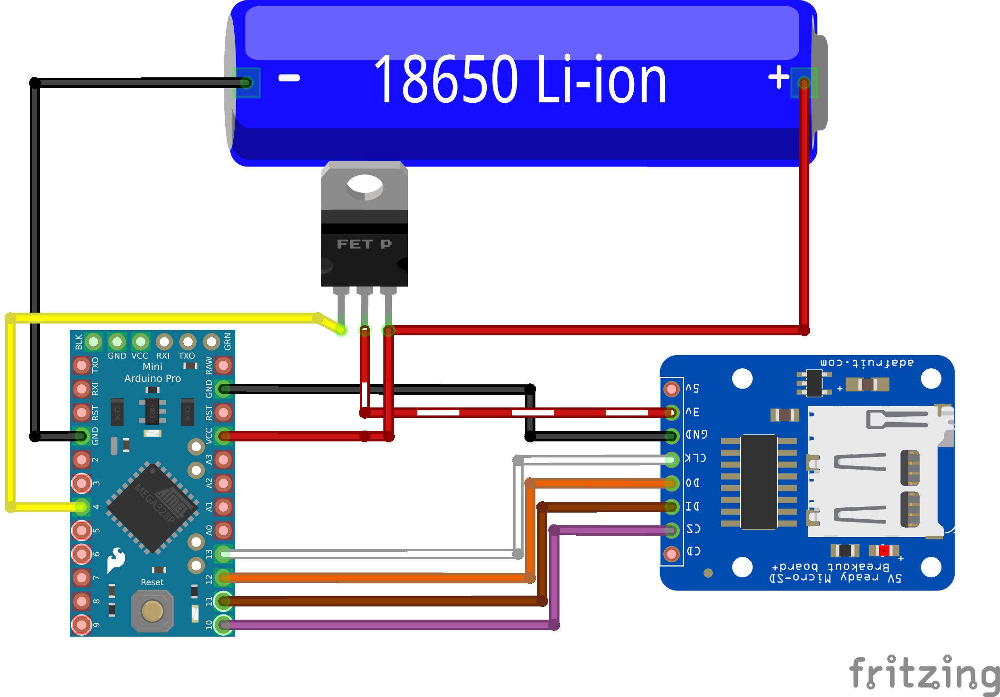

# Ultra-Low Power Arduino Datalogger - Version C (Simple)

> 📜 *Version C circuit schematic: Arduino Pro Mini + SD card + P-MOSFET power gating.*

## Overview
This project implements a simple low-power datalogger using:
- Arduino Pro Mini (3.3V, 8MHz)
- P-Channel logic level MOSFET (NDP6020P) (Intentionally picked for non-smd package) https://www.onsemi.com/download/data-sheet/pdf/ndp6020p-d.pdf
- microSD card module
- Watchdog Timer (WDT) for wake-up

Every 10 minutes, the Arduino wakes up, powers on the SD card, saves 5 lines of data into a uniquely named file, and goes back to deep sleep. The SD card is properly powered off between events to conserve battery life.

---

## Features
- Wake up every 10 minutes using WDT
- Save 5 data entries to a uniquely named file (DATAxxx.CSV)
- Sleep current: < 0.1 µA
- Logging current: ~10-20 mA
- Estimated battery life: 1-2+ years (LiFePO4 or 3xAA)

---

## BOM (Bill of Materials)

| Component             | Suggested Part                               |
|-----------------------|----------------------------------------------|
| Microcontroller       | Arduino Pro Mini (3.3V, 8MHz)                |
| SD Card Module        | SPI microSD module                           |
| P-Channel MOSFET      | NDP6020P (TO-220 package)                    |
| Battery               | 3.2V LiFePO4 14500 or 3xAA NiMH              |
| Resistor 1            | 10kΩ pull-up for MOSFET gate                 |
| Resistor 2            | 100Ω in series to gate (optional protection) |
| Capacitor (optional)  | 0.1µF across SD module VCC/GND               |

---

## Wiring

| Arduino Pin        | Connected To                                |
|--------------------|---------------------------------------------|
| D4                 | Gate of MOSFET (through 100Ω resistor)      |
| VCC (Pro Mini)     | 3.3V Battery + (direct connection)          |
| 3.3V Battery +     | Source of P-MOSFET                          |
| MOSFET Drain       | VCC of SD Module                            |
| GND                | Common Ground (Arduino, SD module, Battery -) |
| D10 (SS)           | SD Card CS pin                              |
| D11 (MOSI)         | SD Card MOSI                                |
| D12 (MISO)         | SD Card MISO                                |
| D13 (SCK)          | SD Card SCK                                 |

- Add a **10kΩ pull-up resistor** between MOSFET Gate and Source (keeps MOSFET off by default).
- Insert a **100Ω resistor** between Arduino D4 and MOSFET Gate (optional, for ESD protection).

---

# 🔋 Power Consumption Breakdown

## Arduino Pro Mini (3.3V, 8MHz)
- **Active Mode**: ~3.6 mA  
  *Measured with power LED and voltage regulator removed.*  
  **Source**: [IoT Experiments](https://www.iot-experiments.com/arduino-pro-mini-power-consumption/)

- **Sleep Mode (SLEEP_MODE_PWR_DOWN)**: ~4.2 µA  
  *With ADC and BOD disabled.*  
  **Source**: [IoT Experiments](https://www.iot-experiments.com/arduino-pro-mini-power-consumption/)

## Watchdog Timer (WDT)
- **During Sleep**: ~6 µA  
  *WDT adds around 6 µA extra consumption during sleep.*  
  **Source**: [Arduino Forum](https://forum.arduino.cc/t/arduino-mini-pro-3-3v-8mhz-wake-up-go-to-sleep-times/689112)

## microSD Card Module
- **Write Operation**: ~60–100 mA  
  *Depends on SD card model and write speed.*  
  **Source**: [Gough's Tech Zone](https://goughlui.com/2021/02/27/experiment-microsd-card-power-consumption-spi-performance/)

- **Idle (Card Inserted, Not Powered Down)**: ~0.2–2.5 mA  
  *Some cards have higher leakage even when idle.*  
  **Source**: [TI E2E Forum](https://e2e.ti.com/support/microcontrollers/msp-low-power-microcontrollers-group/msp430/f/msp-low-power-microcontroller-forum/604414/msp430g2553-how-to-reduce-power-consumption-while-using-micro-sd-card)

- **Powered Off via MOSFET**: ~0 µA  
  *SD card VCC is physically disconnected.*

## P-Channel MOSFET (NDP6020P)
- **Gate Leakage Current**: Negligible  
  *Typically in the nA range.*  
  **Source**: [NDP6020P Datasheet](https://www.onsemi.com/download/data-sheet/pdf/ndp6020p-d.pdf)

---

# 🔋 Power Consumption Analysis for Version C

## Phase-by-Phase

| Phase                    | Current            | Duration           | Notes                          |
|---------------------------|--------------------|--------------------|--------------------------------|
| Wake-up & Setup           | ~3.6 mA             | 5 ms               | Arduino wakes, no SD active    |
| SD Power ON + Init        | ~60–80 mA           | 150 ms             | SD module powered ON, initialized |
| File Write (5 lines)      | ~80–100 mA          | 250 ms             | Active SD write                |
| File Close                | ~60 mA              | 50 ms              | Finalizing file                |
| SD Power OFF              | ~3.6 mA             | Instantaneous      | Turn SD off via MOSFET         |
| Sleep Mode (WDT active)   | ~10 µA              | 599 seconds (~10 min) | Ultra-low power sleeping |

---

## 📊 Energy Summary

| Metric                 | Value                 |
|-------------------------|------------------------|
| Energy per 10 min cycle | ~0.0118 mAh             |
| Energy per hour         | ~0.0708 mAh             |
| Energy per day          | ~1.6992 mAh             |

---

## 🔋 Battery Life Estimation

| Battery                  | Capacity   | Est. Lifetime        |
|---------------------------|------------|----------------------|
| 14500 LiFePO₄ (600 mAh)   | 600 mAh    | ~353 days (~0.97 yr) |
| 3xAA NiMH (2000 mAh)      | 2000 mAh   | ~1176 days (~3.2 yr) |

---

## 📚 References
- [IoT Experiments - Pro Mini Power](https://www.iot-experiments.com/arduino-pro-mini-power-consumption/)
- [Gough's Tech Zone - SD Power Testing](https://goughlui.com/2021/02/27/experiment-microsd-card-power-consumption-spi-performance/)
- [Arduino Forum - WDT Sleep](https://forum.arduino.cc/t/arduino-mini-pro-3-3v-8mhz-wake-up-go-to-sleep-times/689112)
- [NDP6020P Datasheet](https://www.onsemi.com/download/data-sheet/pdf/ndp6020p-d.pdf)

---

## Setup Instructions

1. Wire Pro Mini, MOSFET, and SD card as described.
2. Flash the code via an FTDI adapter (use 3.3V logic).
3. Insert a formatted FAT32 microSD card.
4. Power the system with a 3.2V LiFePO4 battery.
5. Observe new files being created every 10 minutes.

---

## Requirements Mapping to Version C

| Requirement             | Version C Implementation                    |
|--------------------------|------------------------------------------------------------- |
| MCU                      | Arduino Pro Mini (3.3V, 8 MHz)                               |
| Sleep to save power      | Pro Mini sleeps in SLEEP_MODE_PWR_DOWN                       |
| Wake every 10 minutes    | Use WWDT interrupt, 8s x 75 cycles                           |    
| Data logging             | Save 5 rows into uniquely named file (e.g., DATA001.CSV)     |
| Minimize SD card power   | SD card powered by P-MOSFET (NDP6020P) controlled by D4      |
| Minimal idle current     | SD card and Pro Mini turned off between loggings, Pro Mini consumes <0.1 µA when asleep |
| Robust SD handling       | Using SdFat library (not SD.h) to reliably reinitialize after power-off |

---

## Notes
- Use SdFat instead of SD.h to avoid SD card initialization failure after reboot.
- Always ensure the MOSFET cleanly turns off SD card power between events.
- Use a pull-up resistor on the MOSFET gate to prevent accidental turn-on.
